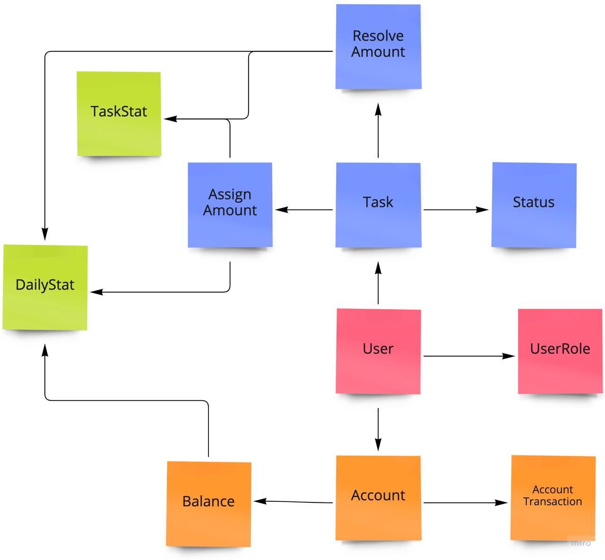

# Домашка (неделя 1)

## Разбиение требований на состовляющие

[Разбиение команд](./commands.md)

## Модель данных

### Используемые данные

- User, User.Role
- Task, Task.Description, Task.Status, Task.AssignAmount, Task.ResolveAmount, Task.AssignedUser
- Account, Account.Balance
- AccountTransaction
- DailyStat, DailyStat.Revenue, DailyStat.DebtorsAmount
- TaskStat, TaskStat.Date, TaskStat.TopTask, TaskStat.TopTaskAmount

### Домены
- User auth domain
- Task domain (shared: User)
- Accounting domain (shared: User, Task.Description)
- Analytics domain (shared: Task.AssignAmount, Task.ResolveAmount, Task.Description, Account.Balance)

## Сервисы

- Auth
- Task Manager
- Accounting
- Analytics

Сплошными линиями показана синхронная коммуникация, прерывистыми - асинхронная

### Бизнес события

#### Task Manager

Продьюсит:
- User.Logined
- Task.Created  (Accounting, Analytics)
- Task.Assigned (Accounting, Analytics)
- Task.Resolved (Accounting, Analytics)

#### Accounting

Продьюсит:
- User.Logined
- Account.Withdraw (Analytics)
- Account.Fund (Analytics)
- Account.CloseDay (Analytics)

#### Analytics

Продьюсит:
- User.Logined

### CUD события

#### Auth

Рассылает сообщения о CUD пользователей.
Task Manager является консьюмером этих событий.
Возможно Accounting тоже, если надо в момент создания пользователя заводить ему счет
